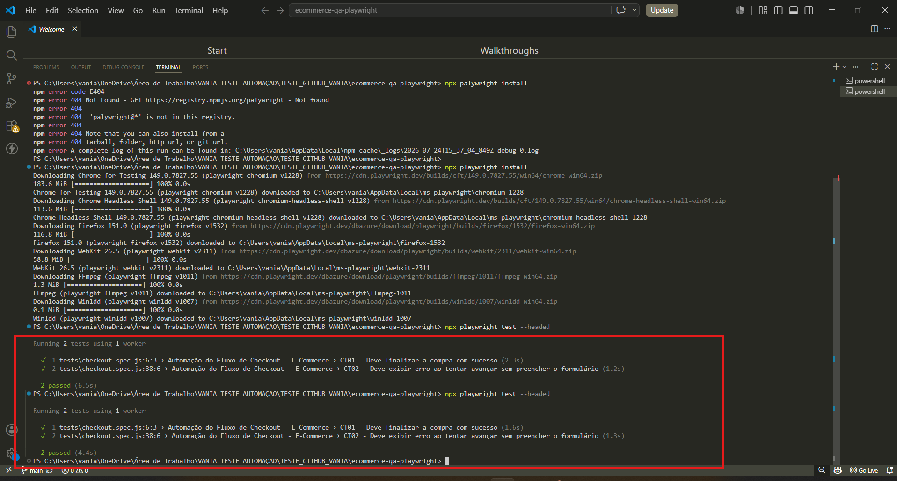

# Relatório de Evidências da Automação com Playwright

Este documento apresenta os resultados da execução da suíte de testes automatizados para o fluxo de checkout do e-commerce modelado (SauceDemo). A automação foi desenvolvida e executada localmente utilizando a ferramenta Playwright.

## Resumo da Execução

A automação validou com sucesso dois cenários críticos de negócio, conforme detalhado abaixo. Ambas as asserções de validação (`expect`) foram atendidas, garantindo que o sistema se comportou conforme o esperado.

* **Cenários Executados:** 2
* **Cenários Aprovados (Passed): ✅ 2**
* **Cenários Falhos (Failed): ❌ 0**
* **Tempo Total de Execução:** ~4.4s

## Evidência Visual da Execução Completa

A imagem abaixo captura o terminal do VS Code após a execução bem-sucedida do comando `npx playwright test --headed`. Esta é a prova concreta da execução e aprovação dos testes na máquina local.

## Entendendo a Execução do Comando (O Porquê)

Para transparência e clareza técnica, o comando `npx playwright test --headed` aciona os seguintes processos automatizados:

1. **`npx`**: Acionador do Node.js que "executa" os programas de teste necessários sem exigir configuração manual complexa.
2. **`playwright test`**: O motor principal que busca arquivos de teste (neste caso, dentro da pasta `tests/` e com extensão `.spec.js`) e inicia o processo de teste.
3. **`--headed`**: Modificador que força o Playwright a abrir a interface visual do navegador, permitindo o acompanhamento visual de cada clique e preenchimento feito pelo robô.
4. **`2 passed`**: O resultado final que indica que as asserções (`expect`) definidas nos scripts de teste foram validadas com sucesso. Isso prova que o sistema se comportou conforme o esperado.

## Conclusão e Próximos Passos

A execução bem-sucedida demonstra a robustez e a confiabilidade do fluxo de checkout do e-commerce. A próxima etapa será explorar formas de integrar essa suíte de testes em um pipeline de Integração Contínua (CI) para validações automáticas a cada alteração de código.
